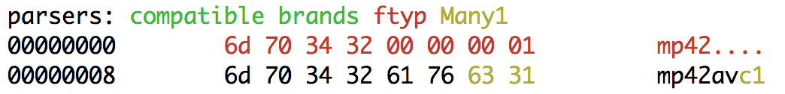
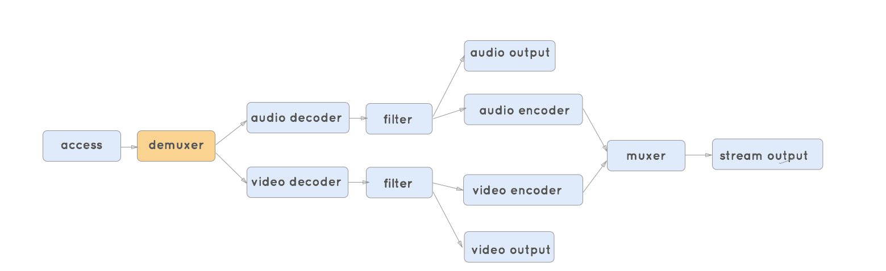

% Langsec Workshop 2017: Writing parsers like it is 2017
% Pierre Chifflier - Geoffroy Couprie
% 2017/05/25

# Who

* Security and QA at Clever Cloud
* Freelance consultant, security and architecture
* <span class="twitter">@gcouprie</span>
* geoffroy.couprie@clever-cloud.com

<details role="note">
rust main language for nearly a year now

we're pushing some Rust in production now
ssh jail, proxy, git subsystems
</details>

# VideoLAN


<details role="note">
what I do at VideoLAN

VLC handles most audio, video and streaming formats
</details>

# VLC media player vulnerabilities

- invalid freeing of pointers in 3GP (CVE-2015-5949)
- crash with divide by zero in ASF (CVE-2014-1684)
- buffer overflow for Dirac streams (CVE-2014-9629)
- invalid memory access in RTP (CVE-2014-9630)
- buffer overflows in MP4 demuxer (CVE-2014-9626, CVE-2014-9627, CVE-2014-9628)

<details role="note">
handling multiple formats is dangerous. MP4 has a lot of flaws, but not the MKV demuxer

fuzzing
</details>

# Format vulnerabilities

* C
* manual parsing
* weird formats

<details role="note">
a good developer would avoid those issues
But how can we fight the urge to write vulnerable code?
</details>

# We need a practical solution

- hard to do mistakes
- memory safe
- embeddable in C (no runtime or GC)
- efficient, streaming

<details role="note">
if not for the "embeddable", I would write some haskell
</details>

# Yay! Rust!


<details role="note">
- Rust makes memory handling easier
- slices are really useful
- easy FFI
</details>

# nom


# what is nom?

- parser combinators
- macros

<details role="note">
I needed an easy way to write parsers
parser combinators are simple, they're just functions
easy to experiment

started in July 2014 (in another repo)
no impl Trait
no lifetime elision
closures?

fighting lifetime issues was (still is) a pain
compilation times
(well, compilation times can be hairy in rust, like the alt! bug)
</details>

# Basic types

```rust
fn parser<Input, Output, Error>(input: Input) -> IResult<Input, Output, Error>
```

```rust
pub enum IResult<Input, Output, CustomError=u32> {
  Done( Input, Output ),
  Error( Err<Input, CustomError> ),
  Incomplete( Needed )
}
```

<details role="note">
EXPLAIN

Done contains output and remaining input
</details>

# MACROS!!!

```rust
named!(data, terminated!( alpha, digit ));
```

<details role="note">
composition of functions

take time to explain here

macros are easy to write
a bit annoying to debug when you don't get the right types
some patterns are hard to express, like the permutation parser
parser combinators are easy to express
</details>

# Generated code

```rust
fn data<'a>(input: &'a [u8]) -> IResult<&'a [u8], &'a [u8], u32> {
  match alpha(input) {
    Done(i, o) => {
      match digit(i) {
        Done(i2, _) => Done(i2, o),
        Incomplete(Needed::Size(i)) =>
          Incomplete(Needed::Size(input.input_len() - i.input_len() + i)),
        e => e,
      }
    },
    e => e
  }
}
```

# Actual generated code

```rust
fn data<'a>(i: &'a [u8]) -> ::nom::IResult<&'a [u8], &[u8], u32> {
    match {
              {
                  use nom::InputLength;
                  match alpha(i) {
                      ::nom::IResult::Error(e) =>
                      ::nom::IResult::Error(e),
                      ::nom::IResult::Incomplete(::nom::Needed::Unknown)
                      =>
                      ::nom::IResult::Incomplete(::nom::Needed::Unknown),
                      ::nom::IResult::Incomplete(::nom::Needed::Size(i))
                      =>
                      ::nom::IResult::Incomplete(::nom::Needed::Size(0usize
                                                                         +
                                                                         i)),
                      ::nom::IResult::Done(i, o) => {
                          {
                              use nom::InputLength;
                              match digit(i) {
                                  ::nom::IResult::Error(e) =>
                                  ::nom::IResult::Error(e),
                                  ::nom::IResult::Incomplete(::nom::Needed::Unknown)
                                  =>
                                  ::nom::IResult::Incomplete(::nom::Needed::Unknown),
                                  ::nom::IResult::Incomplete(::nom::Needed::Size(i))
                                  =>
                                  ::nom::IResult::Incomplete(::nom::Needed::Size(0usize
                                                                                     +
                                                                                     ((i).input_len()
                                                                                          -
                                                                                          i.input_len())
                                                                                     +
                                                                                     i)),
                                  ::nom::IResult::Done(i, o) => {
                                      ::nom::IResult::Done(i, (o, o))
                                  }
                              }
                          }
                      }
                  }
              }
          } {
        ::nom::IResult::Error(a) => ::nom::IResult::Error(a),
        ::nom::IResult::Incomplete(i) => ::nom::IResult::Incomplete(i),
        ::nom::IResult::Done(remaining, (_, o)) => {
            ::nom::IResult::Done(remaining, o)
        }
    }
}
```

# nom features

- strings (&str), byte slices and bit streams parsing
- common combinators (many, pair, peek, etc)
- regular expressions
- advanced error management



# benefits

- works on all Rust versions since 1.0
- no syntax extensions, no impl Trait
- supports no_std
- can be as fast as C parsers
- designed with streaming in mind
- very easy to extend (it's just functions!)

# nom 2.0 highlights: whitespace parsing

```rust
named!(key_value<(&str,JsonValue)>,
  ws!(
    separated_pair!(
      string,
      tag!(":"),
      value
    )
  )
);
```

# nom 2.0 highlights: permutation combinator

```rust
named!(perm<&str,(&str, &str, &str)>,
  permutation!(tag!("abcd"), tag!("efg"), tag!("hi"))
);

assert_eq!(perm("efghiabcd"), Done("", ("abcd", "efg", "hi"));
```

# nom 2.0 highlights: do_parse

```rust
named!(tag_length_value,
  do_parse!(
            tag!( &[ 42u8 ][..] ) >>
    length: be_u8                 >>
    bytes:  take!(length)         >>
    (bytes)
  )
);
```

# nom 2.0 highlights: custom input types

- not limited to &[u8] and &str anymore
- can work with iterators
- can work with ropes based structures
- will allow SIMD based parsing

# nom 2.0 highlights

- tag_no_case: case independent comparison
- &str and &[u8] specific combinators were merged
- big cleanup and breaking changes
- simple VS verbose error management
- 30% to 50% performance gain for most parsers

# VLC media player


# How VLC works



<details role="note">
The pipeline

access -> demux (=> audio and video streams) -> decode -> filter -> (encode -> stream) | (video and audio out)
</details>

# Code architecture


<details role="note">
- libVLCCore: handles module loading, playlist, synchronization, the whole pipeline
- libVLC: a layer above libVLCCore for external applications
- vlc: a small executable calling libVLC
</details>

# Lifetime of a VLC module

- libVLCCore looks for dynamic libraries in a specified folder
- those dynamic libraries expose three functions:
  - vlc_entry__VERSION (example: vlc_entry__3_0_0a)
  - vlc_entry_copyright__VERSION
  - vlc_entry_license__VERSION
- libVLCCore calls vlc_entry__VERSION and the module registers callbacks
- libVLCCore calls the module when needed

<details role="note">
so we don't control anything from the module, we just take orders
</details>


# The plan

- reproduce needed structures from VLC headers
- link to libVLCCore and import useful functions
- reproduce the module registration code
- write a FLV parser
- parse stuff

# Reproducing structures

```C
struct demux_t
{
    VLC_COMMON_MEMBERS

    module_t    *p_module;

    char        *psz_access;
    char        *psz_demux;
    char        *psz_location;
    char        *psz_file;

    union {
        stream_t *s;
        demux_t *p_next;
    };

    /* es output */
    es_out_t *out; /* our p_es_out */

    [...]
```

<details role="note">
VLC uses a sort of object-like structure, with objects sharing (via a macro) some common members
taking some inspiration from rust-openssl and others here: put the structure definitions and function imports in a separate file, make safer wrappers above them, using Rust types

servo-bindgen can apparently do the job!
</details>

# C structure to Rust

```rust
#[repr(C)]
pub struct vlc_object_t {
  pub psz_object_type: *const c_char,
  pub psz_header:      *mut c_char,
  pub i_flags:         c_int,
  pub b_force:         bool,
  pub p_libvlc:        *mut libvlc_int_t,
  pub p_parent:        *mut vlc_object_t,
}

#[repr(C)]
pub struct demux_t<T> {
  //VLC_COMMON_MEMBERS
  pub psz_object_type: *const c_char,
  pub psz_header:      *mut c_char,
  pub i_flags:         c_int,
  pub b_force:         bool,
  pub p_libvlc:        *mut libvlc_int_t,
  pub p_parent:        *mut vlc_object_t,

  pub p_module:        *mut module_t,

  pub psz_access:      *mut c_char,
  pub psz_demux:       *mut c_char,
  pub psz_location:    *mut c_char,
  pub psz_file:        *mut c_char,

  pub s:               *mut stream_t,
  pub out:             *mut es_out_t,
  pub pf_demux:        Option<extern "C" fn(*mut demux_t<T>) -> c_int>,
  pub pf_control:      Option<extern "C" fn(*mut demux_t<T>, c_int, *const va_list) -> c_int>,

  // 'info' nested struct. Can we do that with Rust FFI?
  pub i_update:        c_uint,
  pub i_title:         c_int,
  pub i_seekpoint:     c_int,

  //FIXME: p_sys contains a pointer to a module specific structure, make it generic?
  pub p_sys:           *mut T,

  pub p_input:         *mut input_thread_t,
}
```

# Importing functions

```rust
mod ffi {
  #[link(name = "vlccore")]
  extern {
    pub fn stream_Read(
      stream: *mut stream_t,
      buf: *const c_void,
      size: size_t) -> ssize_t;
  }
}
```

<details role="note">
try to add a function -> you miss a struct -> add the struct -> you need other structs, etc
</details>

# Writing safer wrappers

```rust
pub fn stream_Read(stream: *mut stream_t, buf: &mut [u8]) -> ssize_t {
  unsafe {
    ffi::stream_Read(stream, buf.as_mut_ptr() as *const c_void, buf.len())
  }
}
```

# preparing a VLC module in C

```C
static int  Open ( vlc_object_t * );
static void Close( vlc_object_t * );

vlc_module_begin ()
    set_description( N_("WAV demuxer") )
    set_category( CAT_INPUT )
    set_subcategory( SUBCAT_INPUT_DEMUX )
    set_capability( "demux", 142 )
    set_callbacks( Open, Close )
vlc_module_end ()
```

<details role="note">
those are macros
</details>

# expanded

```C
int vlc_entry__3_0_0a (vlc_set_cb, void *);
int vlc_entry__3_0_0a (vlc_set_cb vlc_set, void *opaque) {
    module_t *module;
    module_config_t *config = ((void*)0);
    if (vlc_set (opaque, ((void*)0), VLC_MODULE_CREATE, &module))
        goto error;
    if (vlc_set (opaque, module, VLC_MODULE_NAME, ("modules/demux/wav.c")))
        goto error;
    if (vlc_set (opaque, module, VLC_MODULE_DESCRIPTION,
      (const char *)(N_("WAV demuxer"))))
        goto error;
    vlc_set (opaque, ((void*)0), VLC_CONFIG_CREATE, (0x06), &config);
    vlc_set (opaque, config, VLC_CONFIG_VALUE, (int64_t)(4));
    vlc_set (opaque, ((void*)0), VLC_CONFIG_CREATE, (0x07), &config);
    vlc_set (opaque, config, VLC_CONFIG_VALUE, (int64_t)(403));
    if (vlc_set (opaque, module, VLC_MODULE_CAPABILITY, (const char *)("demux")) ||
        vlc_set (opaque, module, VLC_MODULE_SCORE, (int)(142)))
        goto error;
    if (vlc_set (opaque, module, VLC_MODULE_CB_OPEN, Open) ||
        vlc_set (opaque, module, VLC_MODULE_CB_CLOSE, Close))
        goto error;
    (void) config;
    return 0;

  error:
    return -1;
}
```

<details role="note">
taking apart code loading and APIs is where you spend the most time
</details>

# Writing the module registration

```rust
#[allow(non_snake_case)]
#[no_mangle]
pub unsafe extern fn vlc_entry__3_0_0a(
    vlc_set: unsafe extern fn(*mut c_void, *mut c_void, c_int, ...) -> c_int,
    opaque: *mut c_void) -> c_int {
  let module: *mut c_void = 0 as *mut c_void;
  if vlc_set(opaque, 0 as *mut c_void, VLCModuleProperties::VLC_MODULE_CREATE as i32,
             &module) != 0 { return -1; }
  if vlc_set(opaque, module, VLCModuleProperties::VLC_MODULE_NAME as i32,
             PLUGIN_NAME.as_ptr()) != 0 { return -1; }
  let desc = b"FLV demuxer written in Rust\0";
  if vlc_set(opaque, module, VLCModuleProperties::VLC_MODULE_DESCRIPTION as i32,
             desc.as_ptr()) != 0 { return -1; }
  let capability = b"demux\0";
  if vlc_set(opaque, module, VLCModuleProperties::VLC_MODULE_CAPABILITY as i32,
             capability.as_ptr()) != 0 { return -1; }
  if vlc_set(opaque, module, VLCModuleProperties::VLC_MODULE_SCORE as i32, 999) != 0 {
    return -1;
  }
  let p_open: extern "C" fn(*mut demux_t<demux_sys_t>) -> c_int =
    transmute(open as extern "C" fn(_) -> c_int);
  if vlc_set(opaque, module, VLCModuleProperties::VLC_MODULE_CB_OPEN as i32, p_open) != 0 {
    return -1;
  }
  let p_close: extern "C" fn(*mut demux_t<demux_sys_t>) = transmute(close as extern "C" fn(_));
  if vlc_set(opaque, module, VLCModuleProperties::VLC_MODULE_CB_CLOSE as i32, p_close) != 0 {
    return -1;
  }
  0
}
```

#


# after some macro work

```rust
vlc_module!(vlc_entry__3_0_0a,
  set_name("inrustwetrust")
  set_description("FLV demuxer written in Rust")
  set_capability("demux", 999)
  set_callbacks(open, close)
);
```

# Write a FLV parser

```rust
named!(pub header<Header>,
  chain!(
             tag!("FLV") ~
    version: be_u8       ~
    flags:   be_u8       ~
    offset:  be_u32      ,
    || {
      Header {
        version: version,
        audio:   flags & 4 == 4,
        video:   flags & 1 == 1,
        offset:  offset
      }
    }
  )
);
```

<details role="note">
show the do_parse syntax that could replace it
</details>

# In nom 2.0

```rust
named!(pub header<Header>,
  do_parse!(
                tag!("FLV")
    >> version: be_u8
    >> flags:   be_u8
    >> offset:  be_u32
    >> ( Header {
        version: version,
        audio:   flags & 4 == 4,
        video:   flags & 1 == 1,
        offset:  offset
    } )
  )
);
```

# Parse the header

```rust
extern "C" fn open(p_demux: *mut demux_t<demux_sys_t>) -> c_int {
  let p_demux = unsafe { &mut (*p_demux) };
  let sl = stream_Peek(p_demux.s, 9);

  if let IResult::Done(_,h) = flavors::parser::header(sl) {

    vlc_Log!(p_demux, LogType::Info, PLUGIN_NAME, "FOUND FLV FILE\n
      version: {}\nhas_audio: {}\n has_video: {}\noffset: {}\n",
    h.version, h.audio, h.video, h.offset);

    stream_Seek(p_demux.s, h.offset as uint64_t);

    p_demux.pf_demux   = Some(demux);
    p_demux.pf_control = Some(control);
    p_demux.p_sys = Box::into_raw(Box::new(demux_sys_t {
      i_pos: h.offset as usize,
      i_size: 0,
      video_initialized: false,
      video_es_format: unsafe { zeroed() },
      video_es_id: 0 as *mut c_void,
      audio_initialized: false,
      audio_es_format: unsafe { zeroed() },
      audio_es_id: 0 as *mut c_void,
    }));

    return 0;
  }

  -1
}
```

<details role="note">
proceed step by step. Parse a bit, then advance, log everything
</details>

# FLV packets

```rust
named!(pub tag_header<TagHeader>,
  chain!(
    tag_type: switch!(be_u8,
      8  => value!(TagType::Audio) |
      9  => value!(TagType::Video) |
      18 => value!(TagType::Script)
    )                                ~
    data_size:          be_u24       ~
    timestamp:          be_u24       ~
    timestamp_extended: be_u8        ~
    stream_id:          be_u24       ,
    || {
      TagHeader {
        tag_type:  tag_type,
        data_size: data_size,
        timestamp: ((timestamp_extended as u32) << 24) + timestamp,
        stream_id: stream_id,
      }
    }
  )
);
```

<details role="note">
the tag header is preceded by a 4 bytes big endian uint indicating the previous tag's size
</details>

# Now, begin parsing

```rust
extern "C" fn demux(p_demux: *mut demux_t<demux_sys_t>) -> c_int {
  let p_demux = unsafe { &mut (*p_demux) };
  let p_sys = unsafe { &mut (*p_demux.p_sys) };

  let mut header = [0u8; 15];
  let sz = stream_Read(p_demux.s, &mut header);
  if sz < 15 {
    if sz == 4 {
      vlc_Log!(p_demux, LogType::Info, PLUGIN_NAME, "end of stream");
      return 0;
    } else {
      vlc_Log!(p_demux, LogType::Info, PLUGIN_NAME, "could not read header:\n{}",
      &header[..sz].to_hex(8));
      return -1;
    }
  }
```

<details role="note">
the to_hex method is invaluable: show a hexdump od the slice
</details>

# Audio data header

```rust
//stored in 1 byte
pub struct AudioDataHeader {
  pub sound_format: SoundFormat,
  pub sound_rate:   SoundRate,
  pub sound_size:   SoundSize,
  pub sound_type:   SoundType,
}
```

# Audio data header parsing

```rust
pub fn audio_data_header(input: &[u8]) -> IResult<&[u8], AudioDataHeader> {
  if input.len() < 1 {
    return IResult::Incomplete(Needed::Size(1));
  }

  let (remaining, (sformat, srate, ssize, stype)) = try_parse!(input, bits!(
    tuple!(
      switch!(take_bits!(u8, 4),
        0  => value!(SoundFormat::PCM_BE)
      | 1  => value!(SoundFormat::ADPCM)
      | 2  => value!(SoundFormat::MP3)
      | 3  => value!(SoundFormat::PCM_LE)
      | 4  => value!(SoundFormat::NELLYMOSER_16KHZ_MONO)
      | 5  => value!(SoundFormat::NELLYMOSER_8KHZ_MONO)
      | 6  => value!(SoundFormat::NELLYMOSER)
      | 7  => value!(SoundFormat::PCM_ALAW)
      | 8  => value!(SoundFormat::PCM_ULAW)
      | 10 => value!(SoundFormat::AAC)
      | 11 => value!(SoundFormat::SPEEX)
      | 14 => value!(SoundFormat::MP3_8KHZ)
      | 15 => value!(SoundFormat::DEVICE_SPECIFIC)
      ),
      switch!(take_bits!(u8, 2),
        0 => value!(SoundRate::_5_5KHZ)
      | 1 => value!(SoundRate::_11KHZ)
      | 2 => value!(SoundRate::_22KHZ)
      | 3 => value!(SoundRate::_44KHZ)
      ),
      switch!(take_bits!(u8, 1),
        0 => value!(SoundSize::Snd8bit)
      | 1 => value!(SoundSize::Snd16bit)
      ),
      switch!(take_bits!(u8, 1),
        0 => value!(SoundType::SndMono)
      | 1 => value!(SoundType::SndStereo)
      )
    )
  ));

  IResult::Done(&input[1..], AudioDataHeader {
    sound_format: sformat,
    sound_rate:   srate,
    sound_size:   ssize,
    sound_type:   stype,
  })
}
```

# Check the header (audio case)

```rust
if let IResult::Done(_remaining, header) = parser::tag_header(&header[4..]) {
  match header.tag_type {
    TagType::Audio => {
      let mut a_header = [0u8; 1];
      if stream_Read(p_demux.s, &mut a_header) < 1 { return -1; }

      if let IResult::Done(_, audio_header) = parser::audio_data_header(&a_header) {
        // <initialize demuxer with audio format info>

        let p_block: *mut block_t = stream_Block(p_demux.s, (header.data_size - 1) as size_t);
        if p_block == 0 as *mut block_t { return -1; }
        let p_block = unsafe { &mut(*p_block) };

        let out_ref = p_demux.out;
        unsafe {
          to_va_list!(move |v: rs_va_list::va_list| {
            let pf_control: fn(*mut c_void, c_int, rs_va_list::va_list) =
              transmute((*out_ref).pf_control);
            pf_control(out_ref as *mut c_void, ES_OUT_SET_PCR, v);
          }, p_block.i_pts);
        }
        es_out_Send(p_demux.out, p_sys.audio_es_id, p_block);
        return 1;
      } else { return -1; }
```

<details role="note">
there's a hack with va_list: https://github.com/GuillaumeGomez/va_list-rs

sometimes, you can't write rust-y code, you need to adapt to the APIs
</details>

# Demo


# Now, the build system


<details role="note">
we have a VLC plugin that we can drop in the module folder, can we build it inside VLC's tree instead?

VLC uses the autotools heavily, and builds the module correctly for the right platform
automatically (with libtool, etc)
</details>

# First, check for cargo and Rust

```Makefile
AC_ARG_ENABLE(cargo,
    [AS_HELP_STRING([--enable-cargo],
      [Enable rust-based plugins that require cargo to build (default disabled)])])

AS_IF([test "${enable_cargo}" = "yes"], [
  AC_CHECK_PROG(CARGO, [cargo], [yes], [no])
  AC_CHECK_PROG(RUSTC, [rustc], [yes], [no])

  AS_IF([test "$CARGO" != "yes" -o "$RUSTC" != "yes"], [
    AC_MSG_FAILURE("Rust based plugins cannot be built $CARGO $RUSTC")
  ])
  VLC_ADD_PLUGIN([rust_plugin])
])
```

# Declaring and building a Rust module

```Makefile
librust1_plugin_la_SOURCES = ""

librust_plugin.a: demux/rust/src/lib.rs
	cd $(srcdir)/demux/rust
	CARGO_TARGET_DIR="$(abs_builddir)/.libs/" cargo build -v
	mv $(abs_builddir)/.libs/debug/$@ $@

rust_plugin.o: demux/rust/src/lib.rs
	cd $(srcdir)/demux/rust
	CARGO_TARGET_DIR="$(abs_builddir)/.libs/" cargo rustc -- --emit obj
	mv $(abs_builddir)/.libs/debug/$@ $@

am_librust1_plugin_la_OBJECTS = rust_plugin.o
librust1_plugin_la_LIBADD = librust_plugin.a

demux_LTLIBRARIES += librust1_plugin.la
```

<details role="note">
we generate an obj file and give it to the build system
</details>

# Summing up

- work a lot on the build system
- isolate unsafe APIs
- the parser is the easiest part
- we don't own everything

# Next steps

- implement seeking
- merging it in the VLC repository
- predownload dependencies with cargo-vendor
- complete the libVLCCore imports
- more formats

# Greetings

- thanks to Guillaume Gomez (imperio) for his help on the parser and the plugin
- thanks to Luca Barbato (lu-zero) for solving the build system issues

# More info

* Nom: https://github.com/Geal/nom
* slides: http://dev.unhandledexpression.com/slides/rust-belt-rust-2016/vlc
* flavors: https://github.com/Geal/flavors
* helper library: https://github.com/Geal/vlc_module.rs
* the module: https://github.com/Geal/rust-vlc-demux
* twitter: <span class="twitter">@gcouprie</span>


<details role="note">
if you want some stickers...
</details>

# Thanks!


