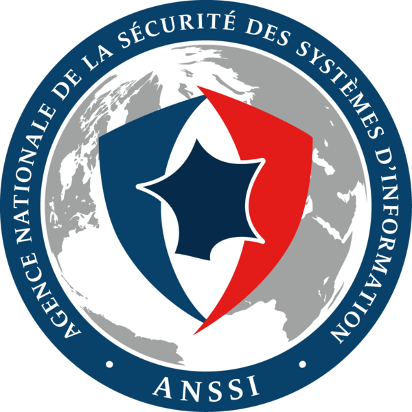
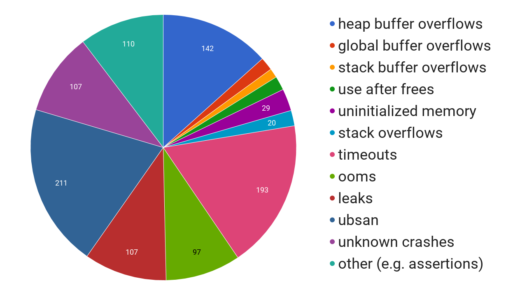
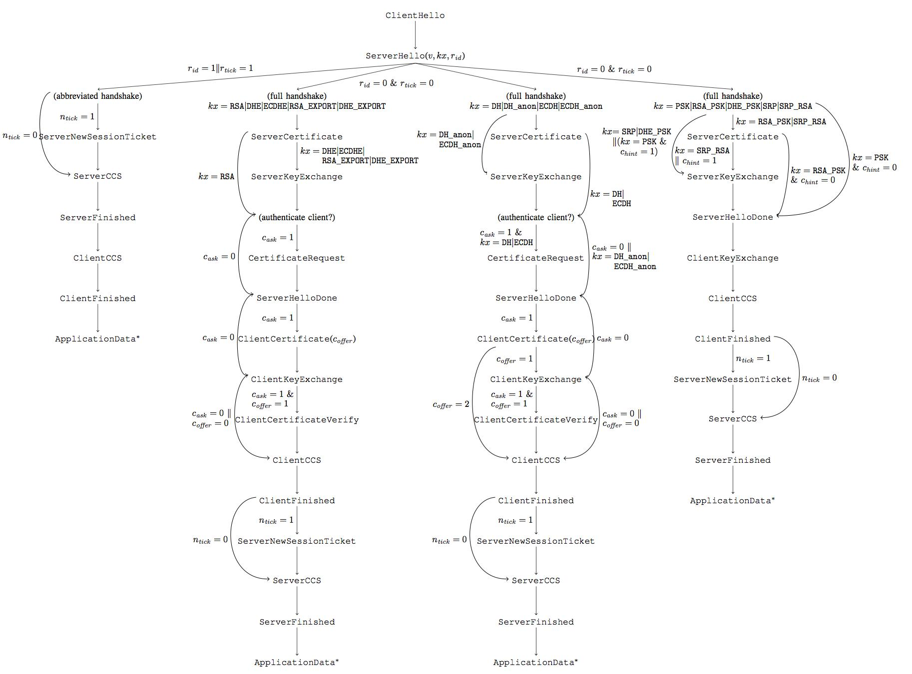
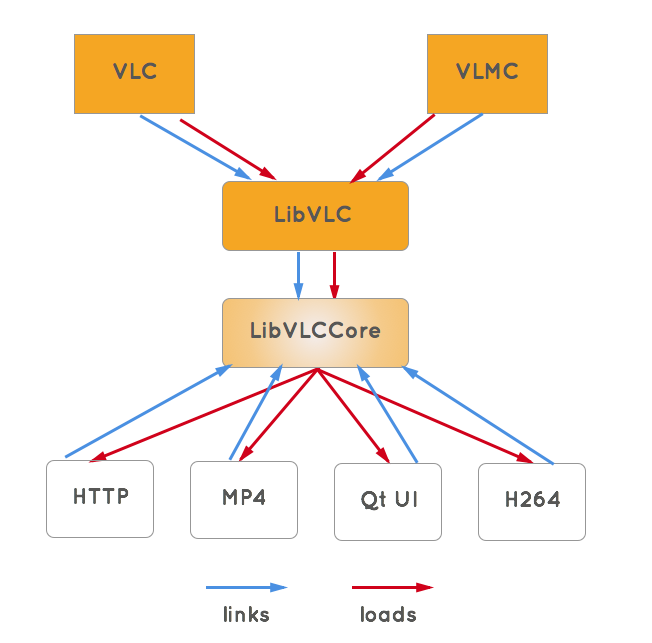
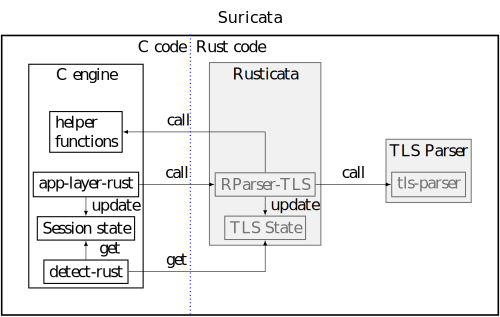

% Langsec Workshop 2017: Writing parsers like it is 2017
% Pierre Chifflier - Geoffroy Couprie
% 2017/05/25

# Who

<table>

<tr>

<td class="smaller" height="50%">
* Geoffroy Couprie
* Security and QA at Clever Cloud
* Freelance consultant, security and architecture
* <span class="twitter">@gcouprie</span>
* geoffroy.couprie@clever-cloud.com
</td>

<td class="smaller" height="50%">
* Pierre Chifflier
* Head of the Detection Research lab at ANSSI
* Security, compilers and languages
* <span class="twitter">@pollux7</span>
* pierre.chifflier@ssi.gouv.fr

</tr>

<tr>
<td>
<center>

</center>
</td>
<td>
<center>

</center>
</td>
</tr>
</table>

<aside class="notes">
rust main language for nearly a year now

we're pushing some Rust in production now
ssh jail, proxy, git subsystems
</details>

# Writing parsers is hard



*(source: Google OSS-Fuzz)*

# Writing new code

- we can write new code in safer languages
- we can make new parsers with better techniques
- we can plan our code for formal proofs

# But...

most of the existing code is written in unsafe
languages with weak development practices

#

## Typically

- in C or C++
- handwritten parsers
- highly coupled code
- hard to test and refactor

# We cannot rewrite those projects entirely

- often between 10k and 1M lines of code
- old code base
- huge domain knowledge

# We cannot rewrite those projects entirely

- big risk of regressions
- politics

# Solution

Surgically replacing the unsafe parts of the code

# Shopping list

- memory safety
- a language that can call C (good FFI support)
- a language that can be called by C
- if possible, no garbage collection
- "fast enough"

<aside class="notes">
fast enough means nearly as fast as C, to convince C developers
</details>

# Rust


<aside class="notes">
- Rust makes memory handling easier
- slices are really useful
- easy FFI
</details>

# Rust

- Managed memory (and no garbage collector)
- Type safety
- Thread safety
- Efficient: native code, zero-copy
- Easy integration with C/C++
- Isolation of *unsafe* code
- Minimal runtime
- Good community

# Parser combinators

Using a safe language is not enough:
```rust
ptr_ip = &s[ x .. y ];

x = s.find("[").unwrap() + 1;
y = x + 26;
ptr_datetime = &s[ x .. y ];

x = y + s[ y .. l ].find('"').unwrap() + 1;
y = x + s[ x .. l ].find(' ').unwrap();
ptr_method = &s[ x .. y ];

x = y + 1;
y = x + s[ x .. l ].find(' ').unwrap() - 1;
ptr_path = &s[ x .. y ];
```

- Fragile code, error-prone
- No error handling
- Using `unwrap()` is wrong here (risk of `panic`)

<aside class="notes">
Unreadable, unmaintainable
</details>

# nom


# what is nom?

- parser combinators
- macros

<aside class="notes">
I needed an easy way to write parsers
parser combinators are simple, they're just functions
easy to experiment

started in July 2014 (in another repo)
no impl Trait
no lifetime elision
closures?

fighting lifetime issues was (still is) a pain
compilation times
(well, compilation times can be hairy in rust, like the alt! bug)
</details>

# Basic types

```rust
fn parser<Input, Output, Error>(input: Input) -> IResult<Input, Output, Error>
```

```rust
pub enum IResult<Input, Output, CustomError=u32> {
  Done( Input, Output ),
  Error( Err<Input, CustomError> ),
  Incomplete( Needed )
}
```

<aside class="notes">
EXPLAIN

Done contains output and remaining input
</details>

# MACROS!!!

```rust
named!(data, terminated!( alpha, digit ));
```

<aside class="notes">
composition of functions

take time to explain here

macros are easy to write
a bit annoying to debug when you don't get the right types
some patterns are hard to express, like the permutation parser
parser combinators are easy to express
</details>

# Generated code

```rust
fn data<'a>(input: &'a [u8]) -> IResult<&'a [u8], &'a [u8], u32> {
  match alpha(input) {
    Done(i, o) => {
      match digit(i) {
        Done(i2, _) => Done(i2, o),
        Incomplete(Needed::Size(i)) =>
          Incomplete(Needed::Size(input.input_len() - i.input_len() + i)),
        e => e,
      }
    },
    e => e
  }
}
```

# Actual generated code

```rust
fn data<'a>(i: &'a [u8]) -> ::nom::IResult<&'a [u8], &[u8], u32> {
    match {
              {
                  use nom::InputLength;
                  match alpha(i) {
                      ::nom::IResult::Error(e) =>
                      ::nom::IResult::Error(e),
                      ::nom::IResult::Incomplete(::nom::Needed::Unknown)
                      =>
                      ::nom::IResult::Incomplete(::nom::Needed::Unknown),
                      ::nom::IResult::Incomplete(::nom::Needed::Size(i))
                      =>
                      ::nom::IResult::Incomplete(::nom::Needed::Size(0usize
                                                                         +
                                                                         i)),
                      ::nom::IResult::Done(i, o) => {
                          {
                              use nom::InputLength;
                              match digit(i) {
                                  ::nom::IResult::Error(e) =>
                                  ::nom::IResult::Error(e),
                                  ::nom::IResult::Incomplete(::nom::Needed::Unknown)
                                  =>
                                  ::nom::IResult::Incomplete(::nom::Needed::Unknown),
                                  ::nom::IResult::Incomplete(::nom::Needed::Size(i))
                                  =>
                                  ::nom::IResult::Incomplete(::nom::Needed::Size(0usize
                                                                                     +
                                                                                     ((i).input_len()
                                                                                          -
                                                                                          i.input_len())
                                                                                     +
                                                                                     i)),
                                  ::nom::IResult::Done(i, o) => {
                                      ::nom::IResult::Done(i, (o, o))
                                  }
                              }
                          }
                      }
                  }
              }
          } {
        ::nom::IResult::Error(a) => ::nom::IResult::Error(a),
        ::nom::IResult::Incomplete(i) => ::nom::IResult::Incomplete(i),
        ::nom::IResult::Done(remaining, (_, o)) => {
            ::nom::IResult::Done(remaining, o)
        }
    }
}
```

# features

- common parser combinator features
- zero-copy parsing
- designed with streaming in mind
- real-world formats

# widely used

existing parsers:

- textual: TOML, CSV, FASTQ
- media format:s GIF, FLAC, FLV
- network: IP, TCP, NTP, SNMP, DNS, TLS, LDAP, HTTP...
- languages: Rust, Lua

# Integrating Rust in existing C projects

- Suricata
- VLC media player


# Suricata


* <a href="https://suricata-ids.org/">Suricata</a>: open source network threat detection engine
* Implements a lot of parsers
* Multi-threaded, fast

# Hardening Suricata


* Isolate critical functions (parsing)
* Use existing code (detection, etc.)
* Keep performances and thread-safety

# Candidate protocol: TLS

- Important protocols
- Many implementation errors
- New 'parser writing' iteration

<aside class="notes">
- I wrote the previous TLS parser
- Writing a parser helps writing the new one
</details>

# Reading RFCs

<div class="smaller">

- [RFC 2246](https://tools.ietf.org/html/rfc2246): The TLS Protocol Version 1.0
- [RFC 4346](https://tools.ietf.org/html/rfc4346): The Transport Layer Security (TLS) Protocol Version 1.1
- [RFC 4366](https://tools.ietf.org/html/rfc4366): Transport Layer Security (TLS) Extensions
- [RFC 4492](https://tools.ietf.org/html/rfc4492): Elliptic Curve Cryptography (ECC) Cipher Suites for Transport Layer Security (TLS)
- [RFC 4507](https://tools.ietf.org/html/rfc4507): Transport Layer Security (TLS) Session
Resumption without Server-Side State
- [RFC 5077](https://tools.ietf.org/html/rfc5077): Transport Layer Security (TLS) Session
Resumption without Server-Side State
- [RFC 5246](https://tools.ietf.org/html/rfc5246): The Transport Layer Security (TLS) Protocol Version 1.2
- [RFC 5430](https://tools.ietf.org/html/rfc5430): Suite B Profile for Transport Layer Security (TLS)
- [RFC 5746](https://tools.ietf.org/html/rfc5746): Transport Layer Security (TLS) Renegotiation Indication Extension
- [RFC 6066](https://tools.ietf.org/html/rfc6066): Transport Layer Security (TLS) Extensions: Extension Definitions
- [RFC 6520](https://tools.ietf.org/html/rfc6520): Transport Layer Security (TLS) and
Datagram Transport Layer Security (DTLS) Heartbeat Extension
- [RFC 6961](https://tools.ietf.org/html/rfc6961): The Transport Layer Security (TLS)
Multiple Certificate Status Request Extension
- [RFC 6962](https://tools.ietf.org/html/rfc6962): Certificate Transparency
- [RFC 7027](https://tools.ietf.org/html/rfc7027): Elliptic Curve Cryptography (ECC) Brainpool Curves
for Transport Layer Security (TLS)
- [RFC 7301](https://tools.ietf.org/html/rfc7301): Transport Layer Security (TLS)
Application-Layer Protocol Negotiation Extension
- [RFC 7366](https://tools.ietf.org/html/rfc7366): Encrypt-then-MAC for Transport Layer Security (TLS) and
Datagram Transport Layer Security (DTLS)
- [RFC 7627](https://tools.ietf.org/html/rfc7627): Transport Layer Security (TLS) Session Hash and
Extended Master Secret Extension
- [RFC 7685](https://tools.ietf.org/html/rfc7685): A Transport Layer Security (TLS) ClientHello Padding Extension
- [RFC 7919](https://tools.ietf.org/html/rfc7919): Negotiated Finite Field Diffie-Hellman Ephemeral Parameters
for Transport Layer Security (TLS)
- [draft-agl-tls-nextprotoneg-03](https://tools.ietf.org/html/draft-agl-tls-nextprotoneg-03): Transport Layer Security (TLS) Next Protocol Negotiation Extension

</div>

# Specifications

```
struct {
       ProtocolVersion server_version;
       Random random;
       SessionID session_id;
       CipherSuite cipher_suite;
       CompressionMethod compression_method;
       select (extensions_present) {
           case false:
               struct {};
           case true:
               Extension extensions<0..2^16-1>;
       };
   } ServerHello;
```

# Method

Define structure

# ServerHello

ServerHello (TLS 1.2)

```rust
pub struct TlsServerHelloContents<'a> {
  pub version: u16,
  pub rand_time: u32,
  pub rand_data: &'a[u8],
  pub session_id: Option<&'a[u8]>,
  pub cipher: u16,
  pub compression: u8,

  pub ext: Option<&'a[u8]>,
}

pub enum TlsMessageHandshake<'a> {
  HelloRequest,
  ClientHello(TlsClientHelloContents<'a>),
  ServerHello(TlsServerHelloContents<'a>),
  ...
}
```

# Method

Write a parser reading the fields as bytes

# TLS parser

ServerHello (TLS 1.2)

```rust
named!(parse_tls_handshake_msg_server_hello_tlsv12<TlsMessageHandshake>,
  do_parse!(
    v:         be_u16 >>
    rand_time: be_u32 >>
    rand_data: take!(28) >> // 28 as 32 (aligned) - 4 (time)
    sidlen:    be_u8 >> // check <= 32, can be 0
               error_if!(sidlen > 32, Err::Code(ErrorKind::Custom(128))) >>
    sid:       cond!(sidlen > 0, take!(sidlen as usize)) >>
    cipher:    be_u16 >>
    comp:      be_u8 >>
    ext:       opt!(complete!(length_bytes!(be_u16))) >>
    (
      TlsMessageHandshake::ServerHello(
        TlsServerHelloContents::new(v,rand_time,rand_data,sid,cipher,comp,ext)
      )
    )
  )
);
```

# Method

Refine fields, writing new parsers

# ServerHello (refined)

```rust
pub enum TlsExtension<'a>{
  SNI(Vec<(u8,&'a[u8])>),
  // ...
};

pub struct TlsServerHelloContents<'a> {
  pub version: u16,
  pub rand_time: u32,
  pub rand_data: &'a[u8],
  pub session_id: Option<&'a[u8]>,
  pub cipher: u16,
  pub compression: u8,

  // This field now contains the parsed extensions
  pub ext: Vec<TlsExtension<'a>>,
}
```

# TLS state machine



<aside class="notes">
Ureadable slide, just to show the complexity of the TLS State Machine.
</details>

# TLS state machine

```Rust
pub enum TlsState {
  None,
  ClientHello,
  AskResumeSession,
  ResumeSession,
  ServerHello,
  ...
}
```

# TLS state machine

```Rust
match (old_state,msg) {
    // Server certificate
    (ClientHello,      &ServerHello(_))       => Ok(ServerHello),
    (ServerHello,      &Certificate(_))       => Ok(Certificate),
    // Server certificate, no client certificate requested
    (Certificate,      &ServerKeyExchange(_)) => Ok(ServerKeyExchange),
    (Certificate,      &CertificateStatus(_)) => Ok(CertificateSt),
    (CertificateSt,    &ServerKeyExchange(_)) => Ok(ServerKeyExchange),
    (ServerKeyExchange,&ServerDone(_))        => Ok(ServerHelloDone),
    (ServerHelloDone  ,&ClientKeyExchange(_)) => Ok(ClientKeyExchange),


    // All other transitions are considered invalid
    _ => Err(InvalidTransition),
```

# Tests

<div class="smaller">


"Because testing is doubting"
</div>

Replacing code requires to show equivalence

- Performance: benchmarks
- Functionnalities: unit tests

<aside class="notes">
- Often the first question you get
    - even when that is not critical
- Required to replace code
</details>


# Unit tests

Encouraged by the language (`cargo test`)

```rust
#[test]
    msg: vec![TlsMessage::Handshake(
             TlsMessageHandshake::ServerHello(
               TlsServerHelloContents {
                version: 0x0303,
                rand_time: 0x57c457da,
                session_id: None,
  // [...]


  assert_eq!(parse_tls_plaintext(DATA), IResult::Done(empty, expected));
```

Tip: use the project's own tests (and test data)


# Checking Security

- manual checks
    - LLVM IR
    - assembly
- fuzzing
    - use "smart" (instrumented) fuzzing
    - try to explore all possible paths
    - very useful to catch unexpected `panic`


# Fuzzing

Using [cargo-fuzz](https://github.com/rust-fuzz/cargo-fuzz) or [afl-rs](https://github.com/frewsxcv/afl.rs)

```
Fuzzers alive : 5
Total run time : 19 days, 13 hours
Total execs : 4054 million
Cumulative speed : 11987 execs/sec
Pending paths : 0 faves, 0 total
Pending per fuzzer : 0 faves, 0 total (on average)
Crashes found : 0 locally unique
```


# Integration ?


# VideoLAN


<aside class="notes">
what I do at VideoLAN

VLC handles most audio, video and streaming formats
</details>

# VLC media player

- dozens of formats and protocols
- written in C and C++

# Code architecture



<aside class="notes">
- libVLCCore: handles module loading, playlist, synchronization, the whole pipeline
- libVLC: a layer above libVLCCore for external applications
- vlc: a small executable calling libVLC
</details>

# Let's build a VLC plugin in Rust

- integrating a FLV parser written with nom
- with an ABI compatible DLL
    - vlc_entry__VERSION (example: vlc_entry__3_0_0a)
    - vlc_entry_copyright__VERSION
    - vlc_entry_license__VERSION
    - the entry function registers structures and callbacks

<aside class="notes">
so we don't control anything from the module, we just take orders
</details>


# The plan

- reproduce needed structures from VLC headers
- link to libVLCCore and import useful functions
- reproduce the module registration code
- write a FLV parser
- parse stuff

# Reproducing structures

```C
struct demux_t
{
    VLC_COMMON_MEMBERS

    module_t    *p_module;

    char        *psz_access;
    char        *psz_demux;
    char        *psz_location;
    char        *psz_file;

    union {
        stream_t *s;
        demux_t *p_next;
    };

    /* es output */
    es_out_t *out; /* our p_es_out */

    [...]
```

<aside class="notes">
VLC uses a sort of object-like structure, with objects sharing (via a macro) some common members
taking some inspiration from rust-openssl and others here: put the structure definitions and function imports in a separate file, make safer wrappers above them, using Rust types

servo-bindgen can apparently do the job!
</details>

# C structure to Rust

```rust
#[repr(C)]
pub struct vlc_object_t {
  pub psz_object_type: *const c_char,
  pub psz_header:      *mut c_char,
  pub i_flags:         c_int,
  pub b_force:         bool,
  pub p_libvlc:        *mut libvlc_int_t,
  pub p_parent:        *mut vlc_object_t,
}

#[repr(C)]
pub struct demux_t<T> {
  //VLC_COMMON_MEMBERS
  pub psz_object_type: *const c_char,
  pub psz_header:      *mut c_char,
  pub i_flags:         c_int,
  pub b_force:         bool,
  pub p_libvlc:        *mut libvlc_int_t,
  pub p_parent:        *mut vlc_object_t,

  pub p_module:        *mut module_t,

  pub psz_access:      *mut c_char,
  pub psz_demux:       *mut c_char,
  pub psz_location:    *mut c_char,
  pub psz_file:        *mut c_char,

  pub s:               *mut stream_t,
  pub out:             *mut es_out_t,
  pub pf_demux:        Option<extern "C" fn(*mut demux_t<T>) -> c_int>,
  pub pf_control:      Option<extern "C" fn(*mut demux_t<T>, c_int, *const va_list) -> c_int>,

  // 'info' nested struct. Can we do that with Rust FFI?
  pub i_update:        c_uint,
  pub i_title:         c_int,
  pub i_seekpoint:     c_int,

  //FIXME: p_sys contains a pointer to a module specific structure, make it generic?
  pub p_sys:           *mut T,

  pub p_input:         *mut input_thread_t,
}
```

# Importing functions

```rust
mod ffi {
  #[link(name = "vlccore")]
  extern {
    pub fn stream_Read(
                       stream: *mut stream_t,
                       buf: *const c_void,
                       size: size_t
           ) -> ssize_t;
  }
}
```

<aside class="notes">
try to add a function -> you miss a struct -> add the struct -> you need other structs, etc
</details>

# Writing safer wrappers

```rust
pub fn stream_Read(stream: *mut stream_t, buf: &mut [u8]) -> ssize_t {
  unsafe {
    ffi::stream_Read(stream, buf.as_mut_ptr() as *const c_void, buf.len())
  }
}
```

# rust-bindgen can automate most of it

# Write a FLV parser

```rust
named!(pub header<Header>,
  do_parse!(
                tag!("FLV")
    >> version: be_u8
    >> flags:   be_u8
    >> offset:  be_u32
    >> ( Header {
        version: version,
        audio:   flags & 4 == 4,
        video:   flags & 1 == 1,
        offset:  offset
    } )
  )
);
```

<aside class="notes">
show the do_parse syntax that could replace it
</details>

# Parse the header

```rust
extern "C" fn open(p_demux: *mut demux_t<demux_sys_t>) -> c_int {
  let data = stream_Peek(p_demux.s, 9);

  if let IResult::Done(_,header) = flavors::parser::header(data) {

    println!("FOUND FLV FILE\n
      version: {}\nhas_audio: {}\n has_video: {}\noffset: {}\n",
    h.version, h.audio, h.video, h.offset);

    stream_Seek(p_demux.s, h.offset as uint64_t);

    // [...]
}
```

<aside class="notes">
proceed step by step. Parse a bit, then advance, log everything
</details>


# Integration with the build system

- autotools will make the final library
- use the Rust compiler to generate a .o
- libtool will handle linking

# Integration



* Rust code: builds an archive (`libsuricata-rust.a`) or `.so`
* Linked with Suricata's executable


# Summing up: parsers

- Use only safe code
- Avoid mixing parsing and interpretion
- Be strict in what you generate, laxist in what you accept
- Parsers are the easiest part

# Summing up: integration

- work a lot on the build system
- isolate unsafe APIs
- the parser is the easiest part
- we don't own everything

# Final step


- Replace the parser in the project


# Results

- **Safe** parsers (with some limits)
- and **reusable**
- Writing parsers is faster
- No more segfaults!

# Feedback

- Biggest difficulty: not technical
- **Strict** language, enforcing checks
- Rust language
    - Sometimes hard to read
    - Macros are hard to debug
    - Lifetimes can be difficult

# More info

* Nom: [https://github.com/Geal/nom](https://github.com/Geal/nom)
* Rusticata: [https://github.com/rusticata](https://github.com/rusticata)
* VLC helper library: https://github.com/Geal/vlc_module.rs
* VLC module: https://github.com/Geal/rust-vlc-demux
* twitter: <span class="twitter">@gcouprie</span>, <span class="twitter">@pollux7</span>


# Thanks

- It's 2017, it's time to do better
    - C is not good for parsers
    - Replacing critical functions is pragmatic and easy
- We need reference parsers
    - Secure
    - For use in multiple projects
- Goal: build a community

<aside class="notes">
We need you!
</details>


# Parser combinators

- Network protocols are hard
    - Complex formats
    - Stateful parsing
    - Many interlaced layers, can be combined
- Reusing parsers is required
    - Example: TLS -> X.509 -> DER, PE -> PKCS7 -> DER, SNMP -> BER

<aside class="notes">
XXX remove that slide ?
</details>

